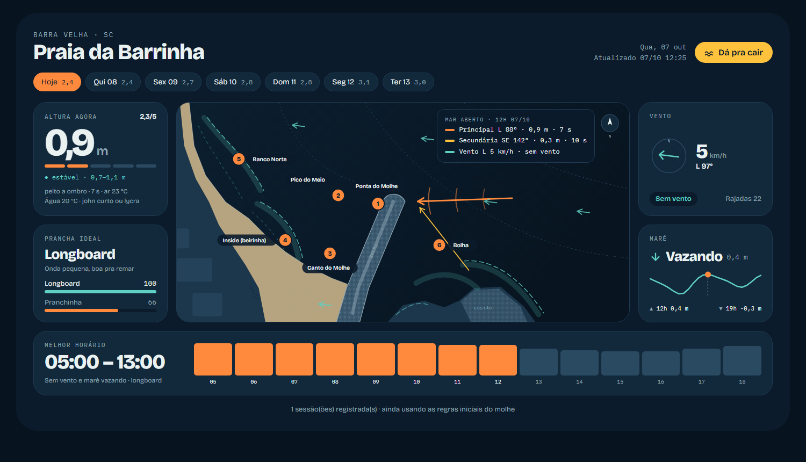
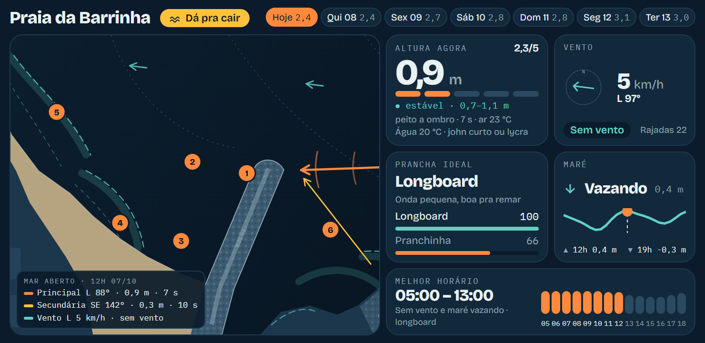

# 🌊 Barrinha Forecast

Previsão de surf feita sob medida para **um pico só**: a Praia da Barrinha (Itajuba), em Barra Velha/SC, ao lado do Molhe de Itajuba.

Os sites de previsão usam um ponto de mar aberto e ignoram o molhe, que muda tudo por aqui: o swell de leste entra direto, o de sul é barrado. Este projeto junta vários modelos de onda e vento, aplica as regras do pico e **aprende com as sessões reais** de quem surfa lá.

**🔗 Ao vivo:** https://juanaudaces.github.io/barrinha_forecast/



## O que mostra

- **Altura estimada na Barrinha**, não no mar aberto, com nota de 0 a 5 pensada para um surfista intermediário.
- **Prancha ideal**: longboard ou pranchinha, com pontuação para cada uma.
- **Melhor horário do dia**, considerando tamanho, período e vento.
- **Vento** em linguagem de surfista (terral, lateral, maral) e **maré** (enchendo/vazando, preia-mar e baixa-mar).
- **Mapa do pico** com as setas das ondulações (principal, secundária e vaga de vento) e do vento, e 6 pontos de referência.
- Temperatura da água e do ar, e qual roupa usar.
- Os próximos 7 dias.

## Como funciona

```
Open-Meteo (grátis)                 surf.py                         GitHub Pages
 ├ 4 modelos de onda   ──────▶  média ponderada            ──────▶  página atualizada
 │  ECMWF · GFS/WW3 ·            × fator do molhe por direção        de hora em hora
 │  MeteoFrance · DWD            × vento terral/maral
 ├ 3 modelos de vento            → nota, prancha, melhor horário
 └ maré e temp. da água          + calibração com as sessões reais
```

- **Sem dependências**: só a biblioteca padrão do Python.
- **GitHub Actions** roda o `surf.py` de hora em hora (e a cada push) e publica no GitHub Pages.
- **Calibração**: cada sessão registrada compara o que os modelos previam com o que realmente aconteceu. Com o tempo, o projeto descobre quanto cada direção de swell "rende" na Barrinha e em qual modelo confiar mais.

## Na parede

Um celular antigo (Samsung J4+) com o [Fully Kiosk Browser](https://www.fully-kiosk.com/) abre a página em tela cheia. Na tela deitada, a página entra num **modo tela** compacto que mostra tudo sem rolagem e recarrega sozinho a cada 30 minutos.



## Uso

Requer Python 3.10+.

```bash
python surf.py                      # gera previsao.html e abre no navegador
python surf.py log 4 1.2            # registra a sessão de agora: nota 1–5 e altura real em metros
python surf.py log 3 2.0 "2026-10-04 15" "pesado, fechando" --levanta 6 --morre 4
python surf.py calibrar             # recalcula os fatores com o diário de sessões
```

Os números de `--levanta` e `--morre` são os pontos do mapa (onde a onda levanta e onde perde força):

| # | Ponto | | # | Ponto |
|---|---|---|---|---|
| 1 | Ponta do Molhe | | 4 | Inside (beirinha) |
| 2 | Pico do Meio | | 5 | Banco Norte |
| 3 | Canto do Molhe | | 6 | Bolha |

Depois de registrar, `git push`: o workflow regenera a página com a calibração nova em cerca de 1 minuto.

### Com o Claude Code

O repositório tem a skill `/calibrar`. É só contar a sessão em português livre ("fui sábado umas 8h, tava na altura do peito, levantando na ponta do molhe, nota 4"), e o Claude registra, calibra e publica.

## Estrutura

| Arquivo | O que é |
|---|---|
| `surf.py` | Tudo: busca de dados, nota, calibração e o HTML da página |
| `sessoes.csv` | Diário de sessões (data, nota, altura real, pontos, observações) |
| `calibracao.json` | Resultado do `calibrar` (fator por direção, peso de cada modelo) |
| `mapa/barrinha.svg` | Mapa estilizado do pico |
| `mapa/pontos.json` | Pontos de referência do mapa |
| `.github/workflows/previsao.yml` | Geração e publicação de hora em hora |
| `.claude/skills/calibrar/` | Skill do Claude Code para registrar sessões |

## Ajustes

As regras do pico ficam no `CONFIG`, no topo do `surf.py`: orientação da praia, quanto o molhe barra cada direção de swell, a faixa de altura ideal para o seu nível e o horário de surf.

## Créditos

- Dados: [Open-Meteo](https://open-meteo.com/) (Marine e Forecast API, uso não comercial)
- Fontes: Bricolage Grotesque e IBM Plex Mono (Google Fonts)

Licença [MIT](LICENSE).
